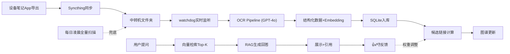

# 产品需求文档 (PRD) — Brain 个人手写笔记知识图谱

## 1. 产品概述

Brain 是一个面向重度笔记用户的「第二大脑」系统：通过中转机后台服务自动监听多设备同步过来的手写笔记（PDF/PNG/JPG），调用 OCR + LLM 抽取结构化信息，构建可交互的笔记知识图谱，并提供基于 RAG 的问答能力与反馈闭环。

- **目标用户**：拥有大量手写笔记（GoodNotes/Notability/OneNote/手拍白板等）、希望把它们变成可检索、可关联、可问答的知识网络的人。
- **核心价值**：零摩擦入库（自动监听同步文件夹）+ 语义关联（图谱可视化笔记间联系）+ 自然语言问答（RAG）+ 反馈自学习。

## 2. 核心功能

### 2.1 用户角色
单用户本地/局域网系统，无需注册登录。中转机运行后台服务，任意设备浏览器访问。

### 2.2 功能模块
1. **图谱页（Graph）**：React Flow 渲染笔记节点与候选链接边，支持缩放/拖拽/筛选/点击查看详情。
2. **问答页（QA）**：聊天框输入问题，RAG 检索相关笔记并生成回答，附带引用笔记，支持 👍/👎 反馈。
3. **笔记浏览页（Notes）**：笔记列表/详情，原图预览 + OCR 文本对照，按设备/App/时间筛选。
4. **后台服务（不可见）**：文件监听 + OCR 处理 + 图谱构建 + 定时兜底扫描 + 反馈学习。

### 2.3 页面详情
| 页面名称 | 模块名称 | 功能描述 |
|-----------|-------------|---------------------|
| 图谱页 | 图谱画布 | React Flow 节点=笔记、边=候选链接；支持缩放、拖拽、框选、自适应布局 |
| 图谱页 | 筛选侧栏 | 按来源设备、来源 App、时间范围、关键词筛选可见节点 |
| 图谱页 | 节点详情面板 | 点击节点展示标题/缩略图/OCR 摘要/关联笔记列表 |
| 问答页 | 聊天对话流 | 消息气泡展示问答历史，回答下方挂引用笔记卡片 |
| 问答页 | 反馈按钮 | 每条回答下方 👍/👎，👎 时弹出修正输入框 |
| 笔记浏览页 | 笔记网格 | 缩略图瀑布流/网格，悬停显示元数据 |
| 笔记浏览页 | 详情对照 | 左原图右 OCR 文本，可复制文本，显示来源设备与时间 |
| 笔记浏览页 | 处理状态 | 显示每张笔记的处理状态（待处理/OCR中/已完成/失败）|

## 3. 核心流程

**笔记入库流程**：各设备笔记 App 自动导出到同步文件夹 → Syncthing 同步到中转机 → watchdog 实时监听发现新文件 → 入队 OCR Pipeline → GPT-4o 抽取标题/关键词/摘要/OCR 文本 + 生成 embedding → 写入 SQLite + 生成缩略图 → 计算与全库笔记的候选链接（语义相似度 + 关键词重合 + 时间衰减）→ 图谱更新。

**问答流程**：用户提问 → 问题 embedding → 向量检索 Top-K 相关笔记 → 组装 RAG Prompt（笔记上下文）→ LLM 生成回答 → 附引用笔记卡片 → 用户 👍/👎 → 反馈记录入库，用于后续链接权重调整。

## 4. 用户界面设计

### 4.1 设计风格
「夜间观星台 / 知识星座」美学——把每条笔记想象成夜空中一颗星，候选链接是连接星光的轨迹。
- **主色**：深空墨蓝 `#0B1020` 背景，节点用柔和的星光色（暖白 `#F5F0E1` 主节点、青蓝 `#6EA8FE` 高亮、琥珀 `#F5A623` 当前选中）。
- **强调色**：边缘发光描边（cyan `#22D3EE` 用于强链接），👎 反馈用玫红 `#F472B6`。
- **字体**：标题用衬线体（知识/编辑感），正文用清晰无衬线，元数据/OCR 等宽体增强「档案」感。避免 Inter/Roboto 等通用字体。
- **布局**：桌面优先，左导航 + 主画布 + 右详情抽屉的三栏结构；图谱画布占据视觉中心。
- **质感**：节点带柔光、连线带渐隐拖尾、背景有极淡的噪点纹理与径向暗角，营造深度。

### 4.2 页面设计概览
| 页面名称 | 模块名称 | UI 元素 |
|-----------|-------------|-------------|
| 图谱页 | 图谱画布 | 深色画布、发光节点、渐隐连线、缩放控件、MiniMap |
| 图谱页 | 左侧筛选栏 | 设备/App/时间/关键词 chips，半透明玻璃面板 |
| 图谱页 | 右侧详情抽屉 | 缩略图、标题、OCR 摘要、关联笔记卡片列表 |
| 问答页 | 对话区 | 气泡消息、引用笔记卡片、👍/👎 圆形按钮 |
| 笔记浏览页 | 笔记网格 | 缩略图卡片、状态徽章、悬停元数据浮层 |
| 笔记浏览页 | 详情对照 | 左原图 / 右 OCR 文本双栏，复制按钮 |

### 4.3 响应式
桌面优先（图谱交互需大屏）。平板自适应（侧栏可折叠为抽屉）。手机提供只读浏览与问答，图谱降级为列表+关系预览。

## 5. 非功能需求
- **轻量化**：后台常驻内存 ~100MB；10000 张笔记数据库 ~600MB；原始文件不进库。
- **部署**：docker-compose 一键起；也支持裸机 Python 直跑。
- **可靠性**：实时监听 + 每日凌晨全量兜底扫描双保险，防丢文件。
- **隐私**：OCR 走云端 API 时仅传文件内容，不传用户身份；本地可配置开关。
