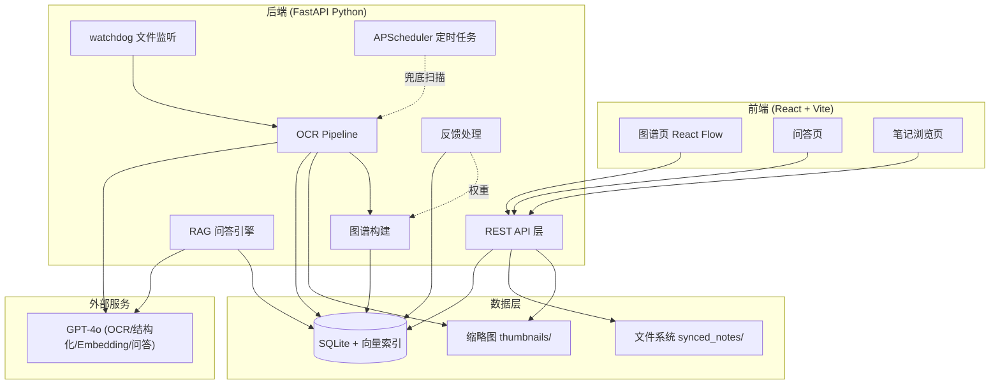
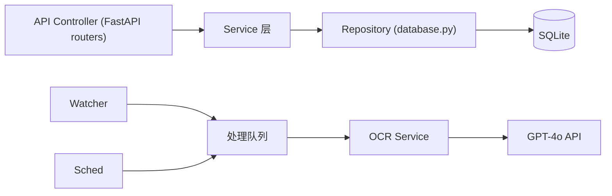

# 技术架构文档 — Brain 个人手写笔记知识图谱

## 1. 架构设计



## 2. 技术说明
- **前端**：React 18 + reactflow + tailwindcss 3 + vite（react-router 多页路由）
- **初始化工具**：vite create
- **后端**：Python 3.11 + FastAPI + Uvicorn
- **文件监听**：watchdog
- **定时任务**：APScheduler
- **数据库**：SQLite（sqlite3 标准库 + 自建向量检索，MVP 不引入额外向量数据库）
- **LLM/OCR**：OpenAI GPT-4o（视觉 OCR + 文本 embedding `text-embedding-3-small` + 对话问答）；本地通过环境变量配置 API Key
- **图像处理**：Pillow（缩略图生成）
- **PDF 处理**：pdf2image / PyMuPDF（PDF 转图像喂给视觉模型）
- **部署**：docker-compose（backend + frontend 静态托管）

## 3. 路由定义（前端）
| 路由 | 用途 |
|-------|---------|
| `/graph` | 图谱页，React Flow 可视化 |
| `/qa` | 问答页，RAG 聊天 |
| `/notes` | 笔记浏览页，网格列表 |
| `/notes/:id` | 笔记详情，原图+OCR 对照 |

## 4. API 定义（后端 REST）

### 4.1 笔记相关
| 方法 | 路径 | 说明 |
|------|------|------|
| GET | `/api/notes` | 列表，支持 `device`/`app`/`q`/`status`/`limit`/`offset` 筛选 |
| GET | `/api/notes/{id}` | 单条详情（含 OCR 文本、元数据） |
| GET | `/api/notes/{id}/file` | 原始文件流 |
| GET | `/api/notes/{id}/thumbnail` | 缩略图 |
| POST | `/api/notes/reprocess/{id}` | 重新触发某条笔记 OCR |

### 4.2 图谱相关
| 方法 | 路径 | 说明 |
|------|------|------|
| GET | `/api/graph` | 返回节点与边，支持筛选参数 |
| GET | `/api/graph/neighbors/{id}` | 某节点的相邻笔记 |

### 4.3 问答相关
| 方法 | 路径 | 说明 |
|------|------|------|
| POST | `/api/qa/ask` | body: `{question}`；返回 `{answer, citations:[{note_id, title, snippet}]}` |
| GET | `/api/qa/history` | 问答历史 |

### 4.4 反馈相关
| 方法 | 路径 | 说明 |
|------|------|------|
| POST | `/api/feedback` | body: `{qa_id, rating: "up"|"down", correction?: string}` |

### 4.5 系统/状态
| 方法 | 路径 | 说明 |
|------|------|------|
| GET | `/api/stats` | 笔记数、链接数、处理中队列长度等 |
| GET | `/api/health` | 健康检查 |

## 5. 服务端架构图


## 6. 数据模型

### 6.1 ER 图
```mermaid
erDiagram
    notes ||--o{ links : "参与"
    notes ||--o{ qa_history : "被引用"
    qa_history ||--o{ feedback : "收到"
    notes {
        INTEGER id PK
        TEXT file_path
        TEXT title
        TEXT ocr_text
        TEXT summary
        TEXT keywords JSON
        TEXT source_device
        TEXT source_app
        TEXT status
        BLOB embedding
        TEXT thumbnail_path
        TEXT created_at
        TEXT processed_at
    }
    links {
        INTEGER id PK
        INTEGER source_note_id FK
        INTEGER target_note_id FK
        REAL weight
        TEXT reason
        TEXT link_type
        TEXT created_at
    }
    qa_history {
        INTEGER id PK
        TEXT question
        TEXT answer
        TEXT citations JSON
        TEXT created_at
    }
    feedback {
        INTEGER id PK
        INTEGER qa_id FK
        TEXT rating
        TEXT correction
        TEXT created_at
    }
```

### 6.2 建表语句
```sql
CREATE TABLE IF NOT EXISTS notes (
    id INTEGER PRIMARY KEY AUTOINCREMENT,
    file_path TEXT UNIQUE NOT NULL,
    title TEXT,
    ocr_text TEXT,
    summary TEXT,
    keywords TEXT,            -- JSON 数组
    source_device TEXT,
    source_app TEXT,
    status TEXT DEFAULT 'pending',  -- pending/processing/done/failed
    embedding BLOB,           -- 序列化的 float 向量
    thumbnail_path TEXT,
    file_hash TEXT,
    created_at TEXT NOT NULL,
    processed_at TEXT
);
CREATE INDEX IF NOT EXISTS idx_notes_status ON notes(status);
CREATE INDEX IF NOT EXISTS idx_notes_source ON notes(source_device, source_app);
CREATE INDEX IF NOT EXISTS idx_notes_file_hash ON notes(file_hash);

CREATE TABLE IF NOT EXISTS links (
    id INTEGER PRIMARY KEY AUTOINCREMENT,
    source_note_id INTEGER NOT NULL,
    target_note_id INTEGER NOT NULL,
    weight REAL NOT NULL,
    reason TEXT,
    link_type TEXT,           -- semantic/keyword/temporal
    created_at TEXT NOT NULL,
    FOREIGN KEY (source_note_id) REFERENCES notes(id),
    FOREIGN KEY (target_note_id) REFERENCES notes(id),
    UNIQUE(source_note_id, target_note_id, link_type)
);

CREATE TABLE IF NOT EXISTS qa_history (
    id INTEGER PRIMARY KEY AUTOINCREMENT,
    question TEXT NOT NULL,
    answer TEXT,
    citations TEXT,           -- JSON 数组
    created_at TEXT NOT NULL
);

CREATE TABLE IF NOT EXISTS feedback (
    id INTEGER PRIMARY KEY AUTOINCREMENT,
    qa_id INTEGER NOT NULL,
    rating TEXT NOT NULL,     -- up/down
    correction TEXT,
    created_at TEXT NOT NULL,
    FOREIGN KEY (qa_id) REFERENCES qa_history(id)
);
```

## 7. 候选链接权重计算
```
weight = α * cosine_sim(emb_a, emb_b)
       + β * jaccard(keywords_a, keywords_b)
       + γ * temporal_decay(time_diff)

默认 α=0.6, β=0.3, γ=0.1
temporal_decay = exp(-|Δt_days| / 30)
仅保留 weight > 阈值（如 0.35）的候选链接
反馈 👍 提升相关笔记间链接权重，👎 降低
```

## 8. 项目结构
```
brain/
├── backend/
│   ├── main.py              # FastAPI 入口 + 静态文件托管
│   ├── config.py            # 配置（监听目录/阈值/API Key 读取）
│   ├── watcher.py           # watchdog 文件监听
│   ├── ocr_processor.py     # OCR + 结构化 + embedding
│   ├── qa_engine.py         # RAG 问答
│   ├── graph_api.py         # 图谱构建与查询
│   ├── feedback.py          # 👍/👎 处理 + 权重调整
│   ├── scheduler.py         # APScheduler 定时兜底扫描
│   ├── database.py          # SQLite 操作 + 向量检索
│   ├── routes/              # API 路由分组
│   └── requirements.txt
├── frontend/
│   ├── src/
│   │   ├── pages/           # Graph / QA / Notes
│   │   ├── components/      # React Flow 图谱组件等
│   │   ├── api/             # 后端 API 调用封装
│   │   └── main.jsx
│   ├── index.html
│   ├── vite.config.js
│   └── package.json
├── docker-compose.yml
├── Dockerfile.backend
├── Dockerfile.frontend
└── README.md
```
